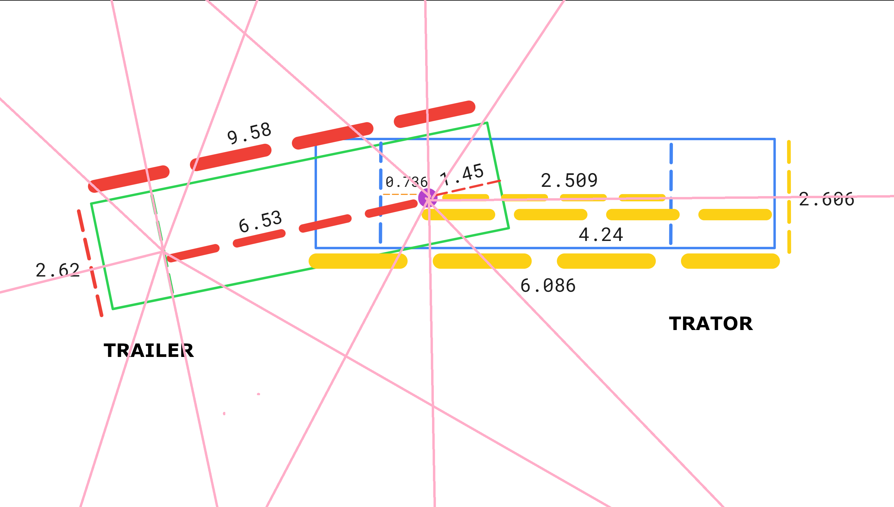

# deep_learning_final_project
Repositório do projeto final de AGL10225 -  Aprendizado Por Reforço

## objetivo

Este projeto tem por objetivo implementar um algoritmo de aprendizado por reforço para um problema de planejamento de rotas de veículos articulados em espaço de estacionamento.

## tecnologias utilizadas
- Python
- NumPy
- Jupyter Notebook
- Stable-Baselines3
- TensorBoard
- OpenAI Gymnasium
- Pytorch
- Pytest
- Matplotlib
- NumPy
- Casadi

### Estrutura do repositório
├── codigos
├── logs: diretório para logs do TensorBoard
├── models: diretório para modelos treinados
├── README.md: este arquivo
├── requirements.txt: arquivo de dependências do projeto
├── scripts: diretório para scripts auxiliares uteis para treinamento
│   ├── clear_logs_models.py: script para limpar logs e modelos treinados
│   └── launch_tensorboard.py: script para iniciar o TensorBoard
├── src: diretório para códigos do projeto final de AGL10225 - Aprendizado Por Reforço
│   ├── ParkingEnv.py: classe do ambiente de simulação
│   ├── ParkingVehicle.ipynb: notebook de treinamento e teste do agente
│   ├── test: diretório para testes unitários
│   │   ├── conftest.py: arquivo de configuração para os testes
│   │   ├── test_collisions.py: teste de colisões
│   │   ├── test_env.py: teste do ambiente
│   │   └── test_map_generation.py: teste de geração do mapa (gera imagens de 3 mapas diferentes)
│   ├── train.py: script para treinar o modelo
│   ├── video: diretório para vídeos de avaliação do agente
│   └── Visualization.py: classe para renderização das simulações (e gravação de vídeos)
└── veiculo_com_os_raycast.png: imagem do veículo com os raycasts

### Ambiente 

O ambiente consiste em um espaço de estacionamento retangular de 90x90 metros (8100 m^2) contendo vagas de estacionamento.
O agente deve posicionar o trailer sobre o objetivo, que é uma vaga de estacionamento, enquanto evita passar por cima das demais vagas.

### Agente:

#### Espaço de observação (o que o agente observa)

Estado: [velocity, theta, beta, alpha*, [r1, r2, ..., r14], goal_proximity, goal_direction_relative, tractor_angle_diff, trailer_angle_diff], onde:
* velocity: velocidade atual do veículo normalizada [-1, 1].
* theta: ângulo de orientação do trator.
* beta: ângulo relativo entre o trator e o trailer.
* alpha*: ângulo de esterçamento do trator.
* r1, ..., r14: distâncias dos raycasts posicionados com origem no veiculo (normalizadas 0-1).
* goal_proximity: proximidade do veículo ao objetivo, calculada como 1 / (1 + distância euclidiana).
* goal_direction_relative: direção até o objetivo RELATIVA ao heading do veículo (egocêntrica).
* tractor_angle_diff: diferença entre a orientação do trator e a orientação da vaga.
* trailer_angle_diff: diferença entre a orientação do TRAILER e a orientação da vaga (crítico para estacionamento).
    

#### Espaço de ação (o que o agente pode fazer)

Controle: [v, alpha], onde:
* v: velocidade do veiculo.	
* alpha: ângulo de esterçamento do trator.

#### Função de recompensa (o que o agente recebe)
* +100 por compleção do objetivo (estacionar na vaga de destino)
* +100 por alinhar o trailer na vaga corretamente ao estacionar (baseado na orientação do trailer)
* +1.0 por metro de progresso em direção ao objetivo
* -100 por colisão com paredes ou outras vagas de estacionamento
* -100 por jackknife
* -20 distribuídos ao longo do episódio como penalidade por tempo: (-10/MAX_STEPS) por passo
* -0.1 por velocidade zero (penalidade por ficar parado)
* -0.02 por mudança brusca de esterçamento (smoothness penalty)

#### critérios de parada
* colisão com obstáculos - incluindo outras vagas de estacionamento que não sejam a de origem ou destino - com o próprio veículo ou paredes do ambiente
* tempo: 90 segundos
* objetivo atingido: veiculo estacionado no ponto de destino.
* episódio terminado: tempo limite atingido.

### Parâmetros de simulação (configurações do ambiente)

limites de angulo de esterçamento do trator: +-28 graus.
limites de taxa de esterçamento do trator: +-10 graus/s.
limites de velocidade do trator: 20km/h ou 5m/s.
angulo de canivete: 65 graus.
limite de visão do sensor de distância: 20 metros.
tempo limite do episódio: 90 segundos.
passo de tempo: 0.2 segundos.
distancia minima para considerar o veículo estacionado: 2 metros do centro da vaga de estacionamento.

